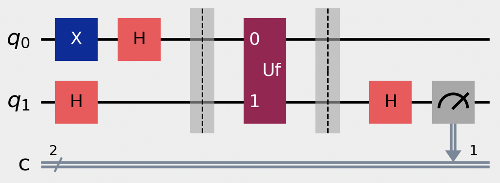
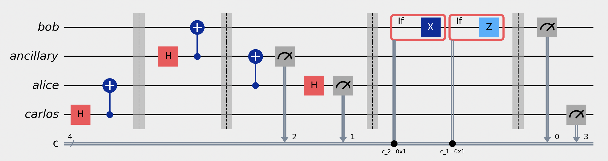
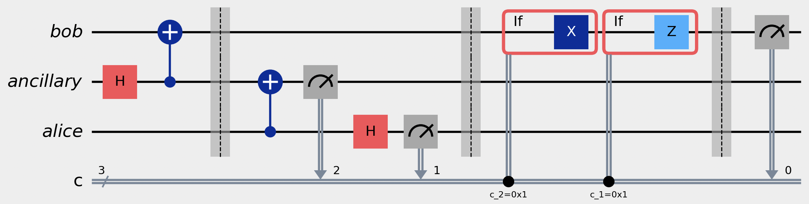

## These are my exercises and algorithms from Hiu Yung Wong's Introduction to Quantum Computing
### Notes and problem sets are in the "Chapters" folder, Algorithms and protocols can be found in the "Algorithms" folder.

Algorithms mainly use qiskit with little endian convention, but matrix/tensor operations with numpy are also present throughout many excercises. You can find a protocol library in quantum_utils.py.

---

#### List of Completed Algoriths/Protocols
(sorted most recent -> oldest)
- **Duetsch Algorithm**
  

    
See circuit diagram

    
  

- **Entanglement Swapping**
  

    
See circuit diagram

    
  

- **Quantum Teleportation**
  

    
See circuit diagram

    
  
